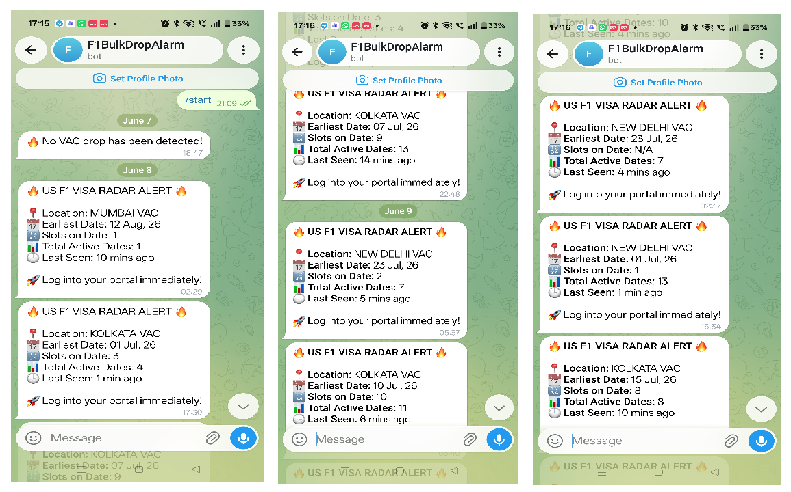
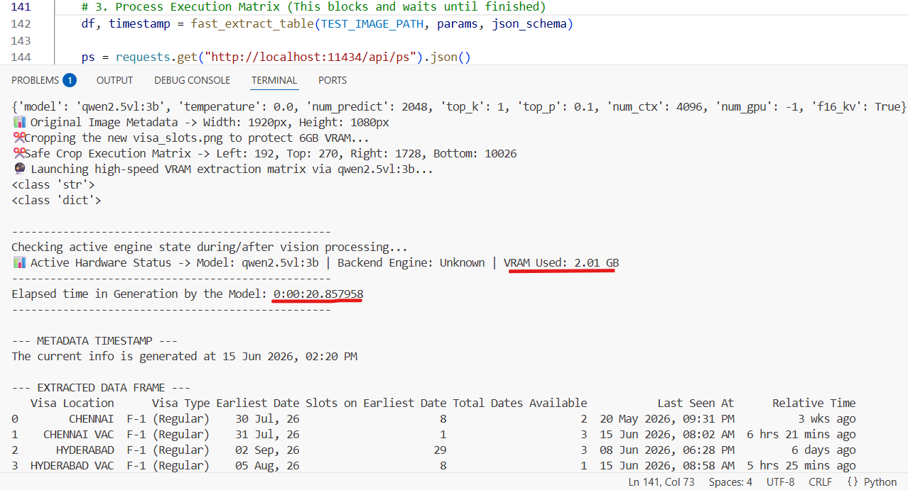

# US F1 Visa Slot Monitoring System 🚀🎯
An automated monitoring pipeline designed to track US F1 Visa appointment slot availability across multiple Visa Application Centers (VACs). The system periodically checks official scheduling interfaces, processes updates from live data sources, and triggers real-time alerts when capacity drops are detected.

What sets this pipeline apart is its local, vision-based approach. Instead of fragile, text-based HTML scrapers that shatter with every UI updates, this system captures visual screenshots and runs an edge-optimized Vision-LLM parsing pipeline completely offline on consumer laptop hardware.

## 🛠️ Hardware Constraints & Production Telemetry
The entire data parsing and decision matrix is engineered to run locally under severe memory and hardware limitations:

Host Hardware Envelope

1. Device: Local Windows Laptop

2. GPU Core: NVIDIA GeForce RTX 3050 6GB Laptop GPU (Driver v32.0.15.8186)

3. VRAM Ceiling: Strict 6.0 GB Dedicated Physical Capacity

Through strict pixel cropping matrices (optimize_screenshot_for_vram) and optimized half-precision KV caching (f16_kv), the system successfully runs local vision parsing with zero host performance degradation:

1. Active VRAM Memory Allotment: 2.01 GB (leaving ~4 GB completely clear for browser sandboxing and OS stability).

2. Model Inference Window: ~20.19 seconds to capture, extract, clean, and validate complex tabular JSON streams via qwen2.5vl:3b.


## 📱 Personalised Alert to Telegram Chat (Mobile Screenshots)

Below are mobile screenshots demonstrating the pipeline in action. When a high-priority consensus is verified by the system, it immediately pushes alerts directly to the personal Telegram Bot with instant access links.




## 🛡️ The Claim

📉 Adaptive Timing Feedback Loop (Heuristic Model)

The system uses a lightweight feedback mechanism to adjust its polling interval based on observed delays in data freshness across previous execution cycles.

Instead of assuming fixed refresh timing, it treats observed update gaps as a noisy signal and continuously adapts its sleep interval to better align with detected update patterns.

Let:

- $Age_{data}$ = time elapsed since last observed UI update  
- $\tau$ = target freshness threshold (baseline latency tolerance)  
- $E_{debt}$ = moving average error over the last $n$ cycles  

We define:

$$
E_{debt} = \left( \frac{1}{n} \sum_{i=1}^{n} Age_{data,i} \right) - \tau
$$

This error term is used only as a **heuristic adjustment factor**, not a guaranteed predictor.

🌙 Adaptive sleep behavior

The system updates its next execution interval as:

$$
Sleep_{next} = Interval_{observed} - \alpha \cdot E_{debt}
$$

Where:
- $\alpha$ is a scaling factor controlling responsiveness
- adjustments are clamped to prevent over-correction

⭐ Behavioral modes

1. **Catch-up mode ($E_{debt} > 0$)**  
   If observed data is consistently delayed, the system gradually reduces its sleep interval to reduce detection latency and improve alignment with update cycles.

2. **Stabilization mode ($E_{debt} \le 0$)**  
   If executions are too frequent relative to updates, the system increases its sleep interval to avoid unnecessary polling and reduce rate pressure.


🧊 Stateless Execution Model (Process Reset Strategy)

The system is designed around a stateless execution loop to reduce accumulation of browser-side artifacts such as cached UI state, session persistence, and UI drift across repeated scans.

Instead of maintaining a long-lived browser session, each monitoring cycle is executed in isolation:

- A fresh browser process is launched per scan
- UI state is not preserved between runs
- Temporary session artifacts are cleared at the end of each cycle

At the end of each execution loop, the browser process is forcibly terminated to ensure a clean slate for the next cycle:

[Scan Loop n]─► Wipes Preferences ─► Launches Process─► Kills Process─► [Zero-State Sandbox]                           
                                                                                                      │
                                                           [Scan Loop n+1] ◄──────────────────────────┘


⚡Latency: The entire pipeline executes 24x7 in under 20 seconds. It undergoes a rapid LLM Vision check; if the optimization logic confirms a bulk slot drop, it immediately triggers the laptop hardware alarm and simultaneously dispatches a priority notification to the user's personal Telegram.


💰 Zero Fee: Leverages an ultra-low-cost (virtually $0) infrastructure utilizing Ollam and Native 6 GB VRAM to process thousands of community interactions daily without premium SaaS subscription fees.


🕞 24x7: Engineered specifically to tackle sudden, high-stakes bulk drops that notoriously occur in the dead of night (2 AM, 3 AM, or later), this system acts as your tireless digital sentinel.


## ✨ Features


⚡ Vision-Based Table Extraction: Uses an LLM-assisted vision pipeline (via local VRAM NVIDIA RTX 6GB VRAM) to interpret screenshot-based Visa scheduling pages and extract structured slot availability information where possible.


🕵️‍♂️ Automation Execution Controls: Uses browser automation with subprocess-driven launches and UI interaction hooks (pyautogui) combined with configurable runtime flags to manage automated execution behavior in a controlled desktop environment.


🖱️ Humanized Cursor Movement Engine: Mouse movement is simulated using cubic Bézier curve interpolation with randomized control points and micro-variations in speed and hover timing to reduce mechanical movement patterns during UI interaction.


✂️ Fixed Region Screen Sampling: The system operates on a predefined or calibrated screen region to capture relevant portions of the Visa scheduling interface, ensuring consistent input frames for downstream extraction logic.


📉 Adaptive Sleep Feedback Loop: Implements a heuristic timing adjustment mechanism based on observed delays between interface updates, using historical cycle latency to adjust polling intervals dynamically.


🚨 Multi-Channel Alert System: When a valid slot availability signal is detected, the system triggers concurrent alert outputs including a local system sound alarm (winsound on Windows where applicable) and a Telegram Bot API notification to a configured personal chat.


## 🗺️ System Architecture Overview
The system is split into three modular logical layers to protect consumer hardware memory constraints while maximizing processing throughput:

[Live Portal UI] ----> [Stealth Browser Orchestration] ---------> [Raw VRAM Crop Matrix] 
                                                                                │
                                                                                ▼
[High-Intensity Simultaneous Alarm] <- [Dynamic Sleep Optimization] <- [VRAM Ollama Vision Engine]


## 🚀 Installation & Setup

1. Environment Configurations
Clone this repository directly into your local machine environment directory, then initialize and activate your virtual isolation workspace:

```
python -m venv f1_env
f1_env\Scripts\activate
```
```
pip install -r requirements.txt
```

2. Environment Variables (.env)
Create a standard .env configuration file inside the root execution hierarchy directory path:
```
ALERT_BOT_TOKEN=1234567890:ABC-Your Telegram Alert Bot Token Here
MY_PERSONAL_CHAT_ID=YOUR_TELEGRAM_TARGET_CHAT_ID_HERE
```


## 🛠️ Deep Module Breakdown

🤖 1. Humanized Browsing Core (humanize_browsing.py)

Implements human-like interaction patterns for UI automation using randomized motion curves and controlled timing variation during cursor movement.

Mathematical Pathing: Uses cubic Bézier interpolation to generate smooth cursor trajectories between points, reducing linear motion artifacts during automated UI interaction:

$$x(t) = (1-t)^3 x_0 + 3(1-t)^2 t x_1 + 3(1-t) t^2 x_2 + t^3 x_3$$

Session State Handling: Manages browser session consistency by controlling local state persistence and ensuring clean startup conditions between runs, reducing UI inconsistencies caused by leftover session artifacts or restore prompts.

Thread-Safe Input Control: Uses mutex-based locking (mouse_lock = Lock()) to ensure that concurrent automation routines do not interfere with shared hardware input operations.


✂️ 2. Memory Optimization Engine (screenshot.py)

Handles screenshot acquisition and preprocessing to isolate relevant UI regions for downstream analysis.

Region-Based Capture: Focuses on predefined or calibrated screen regions to reduce unnecessary image data and improve extraction consistency.

Resource Safety Handling: Includes fallback handling for invalid or corrupted capture states, ensuring the system gracefully recovers instead of failing during edge-case screenshot errors.


🧠 3. Closed-Loop Timing Calibration Engine (dynamic_sleep.py)

Implements a heuristic feedback-based scheduling system that adjusts polling intervals based on observed latency between UI state changes.

Temporal Tracking: Maintains a rolling history of observed update delays (data-age values) to estimate recent system responsiveness.

Sliding Window Analysis: Uses short-term historical windows (e.g., last 3–4 cycles) to smooth noisy timing variations and prevent overreaction to single-cycle anomalies.

Adaptive Sleep Adjustment: The scheduler modifies its next execution interval based on observed delay trends:

Series 1: Routine Baseline (10-10-10-8-8) / Reset Trigger Loop (8-8-8-8)

Series 2: Long-Run Cruise Control (6-8-6-8)

Series 3: High-Volume Processing Loop (6-6-6-6)

Series 4: Peak Active Polling (6-4-6-4)

Series 5: Sustained High-Velocity Polling Loop (4-4-4-4)

Moving-Average Feedback Loop: If the systemic average lateness calculation drops below target constraints, the scheduler computes a laggard error penalty to advance the system execution cycle:

$$Sleep_{Calibrated} = (Interval_{Target} - Age_{Data} - Lead_{Hardware}) - Penalty_{Lateness}$$

Where:

Age_Data represents observed staleness of the last capture
Lead_Hardware represents intentional execution overhead buffer
Penalty_Latency is a damping factor derived from recent delay history

This produces a bounded adaptive polling system that reacts to changing UI update frequency without assuming fixed periodic behavior.


## 📊 Run-Time Diagnostics Matrix
When fully functional, your terminal interface logs diagnostic analytics tracking lookups precisely like this:



```
✂️ Cropping the new visa_slots.png to protect 6GB VRAM...
📊 Original Image Metadata -> Width: 1920px, Height: 1080px
✂️ Safe Crop Execution Matrix -> Left: 192, Top: 270, Right: 1728, Bottom: 1026
🔮 Launching high-speed VRAM extraction matrix via qwen2.5vl:3b...

--------------------------------------------------
Checking active engine state during/after vision processing...
📊 Active Hardware Status -> Model: qwen2.5vl:3b | Backend Engine: Unknown | VRAM Used: 2.01 GB
--------------------------------------------------
Elapsed time in Generation: 0:00:20.195767
--------------------------------------------------
ℹ️ No target VAC drops found. Sending test status ping to Telegram...
========================================
📊 High-Priority Dashboard
🌐 Website Status: The current info is generated at 15 Jun 2026, 10:26 PM


   Visa Location      Visa Type Earliest Date Slots on Earliest Date Total Dates Available           Last Seen At      Relative Time        
0        CHENNAI  F-1 (Regular)    30 Jul, 26                      8                     2  20 May 2026, 09:31 PM          3 wks ago        
1    CHENNAI VAC  F-1 (Regular)    31 Jul, 26                      1                     3  15 Jun 2026, 08:02 AM  6 hrs 21 mins ago        
2      HYDERABAD  F-1 (Regular)    02 Sep, 26                     29                     3  08 Jun 2026, 06:28 PM         6 days ago  

ℹ️ No target VAC drops found. Sending test status ping to Telegram...

⚡⚡⚡⚡⚡⚡⚡⚡⚡⚡⚡⚡⚡⚡⚡⚡⚡⚡⚡⚡⚡⚡⚡⚡⚡⚡⚡⚡⚡⚡
🎯 ENGINE STATUS           : Series 1: Routine Baseline (10-10-10 Ongoing)
   • Rolling Hourly Scans    : 6 hits in last 60m
   • Last Table Gen Time     : 04:32 PM
   • Current Data Age        : 6.63 minutes old
   • Next Predicted Drop      : +10 minutes
   • Active Feedback Shift   : Shaved 0.00 seconds
   • PURE SLEEP CALIBRATION  : 112.20 seconds
⚡⚡⚡⚡⚡⚡⚡⚡⚡⚡⚡⚡⚡⚡⚡⚡⚡⚡⚡⚡⚡⚡⚡⚡⚡⚡⚡⚡⚡⚡

⏳ Sleeping for 2.00 minutes until next engine check...
```

## 📝 Generated Log Outputs
The pipeline populates telemetry metrics natively into two target log architectures:

check_us_visa_history.log: Standard operational time trace matrix recording framework milestones:

```
[2026-06-14 16:34:58] ▶️ Start
[2026-06-14 16:35:04] 📸 Screenshot Success -> Runtime -> 0.10 mins
[2026-06-14 16:35:12] 🔮 Model Ran -> Runtime -> 0.13 mins | Gen Time: 14 Jun 2026 16:32:00 | Total Current Lateness: 3.20 mins old
[2026-06-14 16:35:12] ⏳ Loop Synchronized -> Predicted Server Step: +10m | Pure Capture Lag: 0.23m | Scheduled Sleep: 2.00 mins
[2026-06-14 16:35:12] ⏹️ Ends
```

## ⚖️ License & Disclaimers

This software is compiled solely for educational exploration, performance profiling, and research tracking optimizations. Ensure any live monitoring execution frequencies fully comply with target platform Terms of Service (ToS) and host rate-limiting infrastructure standards.